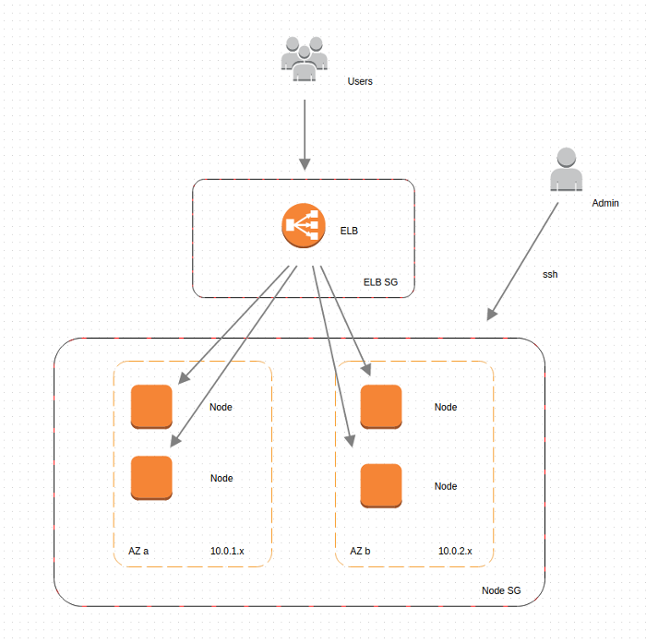

# Ansible Plays for Lightbend ConductR

These plays and playbooks provision [Lightbend ConductR](https://conductr.lightbend.com) cluster nodes in AWS EC2 using [Ansible](http://www.ansible.com). ConductR is the project name for Service Orchestration in Lightbend Production Suite.
 The [ConductrR-Cloudformation](https://github.com/typesafehub/conductr-cloudformation) templates are another way to provision ConductR clusters on AWS EC2.

**This version of ConductR Ansible is compatible with ConductR's Master branch, currently 2.0.x.**
For previous versions, use the corresponding branch, i.e. Conductr-Ansible 1.1.x branch for use with ConductR 1.1.x.

There are three ConductR roles in ConductR cluster: core scheduler, execution agent and dynamic proxy. In a 3 node cluster it is recommended to run all three roles on all three nodes with each node in a different availability zone(AZ).
 This is to provide for a 2 member quorum in the event of any one AZ not being available. The proxy nodes are the ingress point for services. The HAProxy on these nodes is dynamically updated by the conductr-haproxy service.
 These proxy nodes are the instances used in the ELB load balancer and must be reachable by the ELB security group.

For larger clusters, it is recommended to use different node images for each of these roles.
 This enables the scaling of agent nodes without scaling the number of dynamic proxy and core scheduler nodes as these resources generally do not need to be scaled nearly as often. 
 Production deployments will want the additional security of the private-agent model in which only the dynamic proxy nodes are given public IP addresses, keeping the ELB instances out of your private networks.
 The private agent model requires an administrative bastion host for managing nodes with only private IPs.

Use `create-network-ec2.yml` to setup a new VPC within your EC2 account. This is the 'all in one' topology using three nodes running all roles with public IPs. You only need to provide your access keys and what region to execute in.
The playbook outputs a vars file for use with the second playbook, `build-cluster-ec.yml`.
The `username` and `password` in `my.commercial.properties` and the `keypair` in the generated vars file *must* be set.

The playbook `build-cluster-ec2.yml` launches a three nodes running all three functions: the core scheduler,
 the executioner agent and dynamic proxy. A fourth, small template instance is provided for imaging.
 It is recommended to create an image of this node before terminating it. The AMI created can be used to quickly provision a
 replacement node should one fail. Instances launched from the fully installed AMI require only minimal configuration to join this cluster.
 Be certain to review and customize the vars file before building the cluster. In addition to matching the ConductR package
 names with the version provided, the `username` and `password` in `my.commercial.properties` and the `keypair` in the generated vars file *must* be set.

The `create-private-agent-network-ec2.yml` playbook also configures a VPC with separate security groups for public and and private agents.
 It launches an admin bastion host for then running the build cluster playbook from.
 The use of a bastion host is required to manage private agent nodes that will not have a public ip address.
 The `playbook build-private-agent-cluster-ec2.yml` launches three core nodes, three private agents, three public agents
 and one small template node instances across three availability zones. Core, private agent, public agent and template nodes can be of different AMI, instance and volume size.

The `create-bastion.yml` playbook can be used to seed an administrative node into an existing subnet. This can be useful even
 when using the '3x3' model with public IPs for faster bundle management by avoiding uploading over the WAN.

 ```bash
ansible-playbook create-bastion.yml --private-key ../.keys/Key-Pair.pem  -e "VARS_FILE=vars/my_bastion_vars.yml"

 ```

The `create-cloudformation-ami.yml` playbook is for building AMIs for use with [ConductrR-Cloudformation](https://github.com/typesafehub/conductr-cloudformation).

## Prerequisites

You'll need the following in order to use these playbooks.

* Lightbend credentials. Obtain for free from [lightbend.com](https://www.lightbend.com/product/conductr/developer).
 Apply your credentials to `conductr/files/commercial.credentials.template` and save as `conductr/files/my.commercial.credentials`.
* Export the EC2 Access Key and Secret for an AWS Account with sufficient access within EC2 to create instances, security groups and other resources.
* A copy of both the ConductR and ConductR-Agent deb installation package on the Ansible controller host in `conductr/files`.
* Ansible installed on a controller host. The faster the controller host's connection to the chosen EC2 region, the faster files can be synchronized to the nodes.
 Ssh access to a small to medium "bastion" instance in the same AWS region as your cluster works well. See Ansible Setup below for further details.
* An AWS Key Pair (PEM file) downloaded to the Ansible controller host.
* A copy of this GitHub repo on the Ansible controller host.

## Setup

ConductR installation packages are **not** provided by this repository. Visit the [Customer Portal](https://together.lightbend.com/) to download or [Lightbend.com](https://www.lightbend.com/products/conductr)
 to sign up to evaluate Lightbend Production Suite. Developers should use the [developer sandbox](https://www.lightbend.com/product/conductr/developer) to validate bundle packaging and execution.

Obtain your Lightbend credentials from [Lightbend.com](https://www.lightbend.com/product/conductr/developer) and replace `username` and `password` in `conductr/files/my.commercial.properties` using the provided template.

Copy the systemd ConductR deb (conductr_x.y.z-systemd_all.deb) *and* the ConductR-Agent deb (conductr-agent_x.y.z-systemd_all.deb) installation package into the `conductr/files` folder in your local copy of this repo.
 The installation packages will be uploaded from this folder to each of the EC2 instances for installation. The names and versions in the vars file need to be updated whenever changing versions.

Log into the AWS Console and select or generate a key pair in the region you intend to use. You'll need both the path to a copy of the PEM file local to the Ansible host and
 the key pair _name_ used in the AWS console to record in your vars file. Specify the name matching the pem file in `keypair` in the vars file.

## Running the Plays

From an Ansible enabled shell, export your AWS Key and Secret for use by the plays.

```bash
export AWS_ACCESS_KEY_ID='ABC123'
export AWS_SECRET_ACCESS_KEY='abc123'
```

Disable Ansible host key checking so that the play doesn't need you to accept the first connection to the nodes.

```bash
export ANSIBLE_HOST_KEY_CHECKING=False
```

Running the create network play without any arguments defaults to executing in the EC2 region of us-east-1.

```bash
ansible-playbook create-network-ec2.yml
```

Optionally specify what [EC2 region](http://docs.aws.amazon.com/general/latest/gr/rande.html#ec2_region) you want to execute in as `EC2_REGION` using a -e key value pair. For example to execute in eu-west-1: 

```bash
ansible-playbook create-network-ec2.yml -e "EC2_REGION=eu-west-1"
```

To create a network with private and public agent in different subnets run the `create-private-agent-network' playbook. This playbook requires a keypair setting for launching a bastion host

```bash
ansible-playbook create-private-agent-network-ec2.yml  -e "KEYPAIR={{ keyname }}" --private-key /path/to/{{keypair}}
```

The playbook defaults to availability zones `a`, `b`, and `c`. Change the create-network playbook directly to use other or fewer zones.

The create network playbook produces a vars file in the `vars` folder named `{{EC2_REGION}}_vars.yml` where {{EC2_REGION}} is the region used. You **must** add the name of your key pair to `{{EC2_REGION}}_vars.yml` in order to use it with the build cluster script. Change the "Key Pair Name" of `KEYPAIR: "Key Pair Name"` to that of the key pair name, which may be different than the file name and generally does not end in the .pem file extension.

If you want to execute in a region other than us-east-1, you will also need to change the AMI value for `IMAGE` in your vars file to an Ubuntu image in that region. The AMI listed is the Ubuntu 16.04 LTS HVM EBS boot image published by Canonical for us-east-1. Other versions and types of Ubuntu instances are expected to work. The [Ubuntu AMI Locator](http://cloud-images.ubuntu.com/locator/ec2/) can help you find AMI's for alternative regions and instance types.

We pass both our vars file and EC2 PEM key to our playbook as command line arguments. The VARS_FILE template can be the one created from the create script. There is also a `vars.yml` template you can use instead. The private-key value must be the local path and filename of the keypair that has the key pair name `KEYPAIR` specified in the vars file. For example our key pair may be named `ConductR_Key` in AWS and reside locally as `~/secrets/ConductR.pem`. In which case we would set `KEYPAIR` to `ConductR_Key` and pass `~/secrets/ConductR.pem` as our private-key argument.

All the nodes will be assigned a public ip address so you can ssh into nodes using the specified PEM key with the user name from REMOTE_USER in `vars/main.yml`. 

```bash
ansible-playbook build-cluster-ec2.yml -e "VARS_FILE=vars/{{EC2_REGION}}_vars.yml" --private-key /path/to/{{keypair}}
```

or if you are using the private agent network. Be certain to run this from a the bastion node so it has access to the private nodes. Use nohup if needed

```bash
nohup ansible-playbook build-private-agent-cluster-ec2.yml -e "VARS_FILE=vars/{{EC2_REGION}}_vars.yml" --private-key /path/to/{{keypair}} > build_cluster.out &_
```

### Checklist

A few things to double check before running playbooks:
* Credentials in `conductr/files/my.commercial.credenteials"
* ConductR core _and_ agent packages in `conductr/files` _and_ match in the vars file
* Private key file *and* matching name in vars file
* Update AMIs to latest *and* ensure are local to target region
* .dockercfg file for private repo access, if needed
* Ansible running under Python 2.7. Ansible's Python 3 support may cause errors at this time
* Any optional play customization needs.
 This could include adding additional bundle config plays, changing to use Oracle JDK, increasing disk sizes, use syslog instead of the provided ELK stack, not install Docker, etc etc

## Accessing cluster applications

If all went well you now have a three node ConductR cluster. The nodes are registered with the ELB. You can change the script to not assign these nodes public IPs, but you will also need to
 put the ELB into the node security for the nodes to be reachable.

In order to access applications from the internet you must add a listener to the ELB and ensure the ingress ports are accessible from the ELB.
 To expose bundle endpoints to the world you must:
* Add a listener to the ELB. The instance port of the listener will be that of the bundle endpoint. Port `80` to `9000` or `80` is a common listener. Use `tcp` for websockets.
* Grant the ELB-SG inbound access on the instance port in to the `Node-SG`
* If using ELB ports other than the already allowed 80 and 443, allow any address, `0.0.0.0/0`, inbound access on the ELB port in to the ELB-SG.

The Visualizer sample application has been setup as an example. Start at least one instance of Visualizer in the cluster. If you map port `80` to `9999`, you can access the Visualizer sample application using the ELB DNS Name.
. You may delete or remap the Visualizer ELB listeners and corresponding security group access as desired. They are not required by ConductR.

### Running many services on few ports

For the most part, we only expose ports 80 and 443 to the world. We might have an internal ELB mapping to set of services on a different port, but we generally don't want to have many port mappings to manage. Hostnames and paths can be used to segment traffic between applications.

For example to run a staging instance of an application on the same cluster and service endpoint port, use a [Configuration-Bundle](http://conductr.lightbend.com/docs/2.0.x/BundleConfiguration#Configuration-Bundles) with a staging hostname.

 ```
 components = {
   lightbend-www = {
     endpoints = {
       “www” = {
         bind-protocol = “http”
         bind-port = 0
         service-name = “Lightbend_WWW_Staging”
         services = [“http://mdavis.lightbend.com”]
       }
     }
   }
 }
 ```

### Websockets

Applications using websockets require a TCP listener in the ELB instead of a HTTP/HTTPS listener. In this configuration one must [configure proxy protocol support](http://docs.aws.amazon.com/ElasticLoadBalancing/latest/DeveloperGuide/enable-proxy-protocol.html) on the ELB in order to retrieve client connection information.

### Enabling SSL

Add a HTTPS listener to the load balancer in order to access the cluster securely. You will need to upload a X.509 certificate when creating an HTTPS listener if you haven't already. 

### Optional Variables

The vars file templates contain variables for controlling optional features and components.

`VOL_TYPE` and `VOL_SIZE` determine the type and size (GB) of the storage volume attached to each instance. Use `gp2` for General Purpose (SSD) volumes, `io1` for Provisioned IOPS (SSD) volumes, and `standard` for Magnetic volumes.

`ENABLE_DEBUG` defaults to "true." When set to "true," `-Dakka.loglevel=debug` is added to ConductR's `conf/application.ini` to enable ConductR debug level logging. Use "false" to disable.

`ENABLE_ROLES` defaults to "true." When set to "true," `-Dconductr.resource-provider.match-offer-roles=on` is added to ConductR's `conf/application.ini` to enable role matching. Use "false" to disable.

`INSTALL_DOCKER` defaults to "true." When set to "true," the Docker apt repository is used to install Docker for ConductR-Agent usage. Use "false" to disable. Use `docker/files/dockercfg` for DockerHub credentials.

`CONDUCTR_PRIVATE_ROLES` is a list and defaults to `web` and `elasticsearch` if not specified. To append additional role, e.g. `GPU` specify the following within the vars file:

```
CONDUCTR_PRIVATE_ROLES:
  - web
  - elasticsearch
  - test
```

`CONDUCTR_PUBLIC_ROLES` is a list and defaults to `haproxy` if not specified. To append additional role, e.g. `public` specify the following within the vars file:

```
CONDUCTR_PUBLIC_ROLES:
  - haproxy
  - public
```

## Ansible Setup

These plays are being developed out of the current master branch of Ansible. They may or may not work with older packaged versions.

Setup Ansible from source using git and pip.

```bash
git clone https://github.com/ansible/ansible.git --recursive
sudo apt-get install python-setuptools autoconf g++ python2.7-dev
sudo apt-get install build-essential libssl-dev libffi-dev python-dev
sudo easy_install pip
sudo pip install paramiko PyYAML Jinja2 httplib2 boto
```

Should `pip` not satisfy requirements, `easy_install` is an alternative python installer. Example: `sudo python -m easy_install pyyaml`.

Create a hosts file for Ansible.

```bash
sudo mkdir /etc/ansible
echo -e "[local]\n127.0.0.1" | sudo tee -a /etc/ansible/hosts
```

Configure a shell to use Ansible from source

```bash
cd ansible
source ./hacking/env-setup -q
```

## Network Architecture

The architecture created by create-network-ec2.yml utilizes three Availability Zones (AZs) but can be adjusted to more. The image below uses two AZs for simiplicity.




### Private Agent mode
Both the VPC creation and cluster building playbooks have 'private-agent' versions. They are used exactly as above but have more amis, subnets. security groups, etc.
